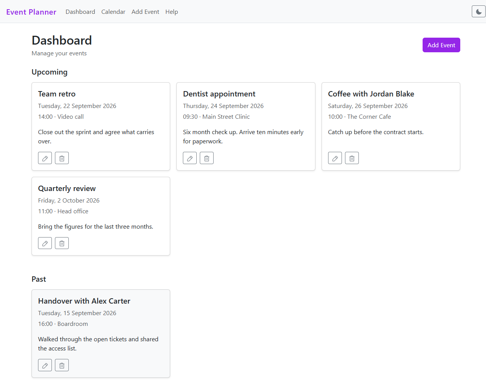
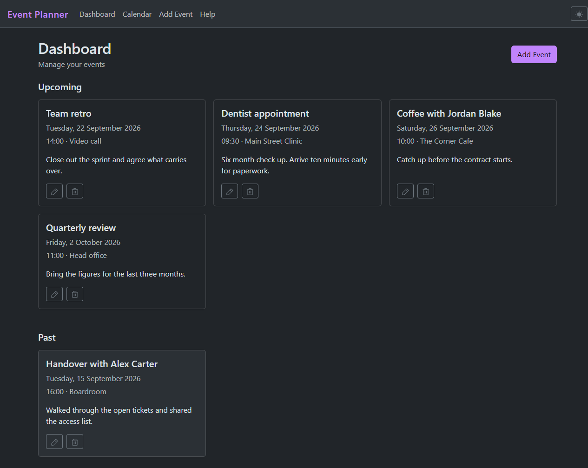
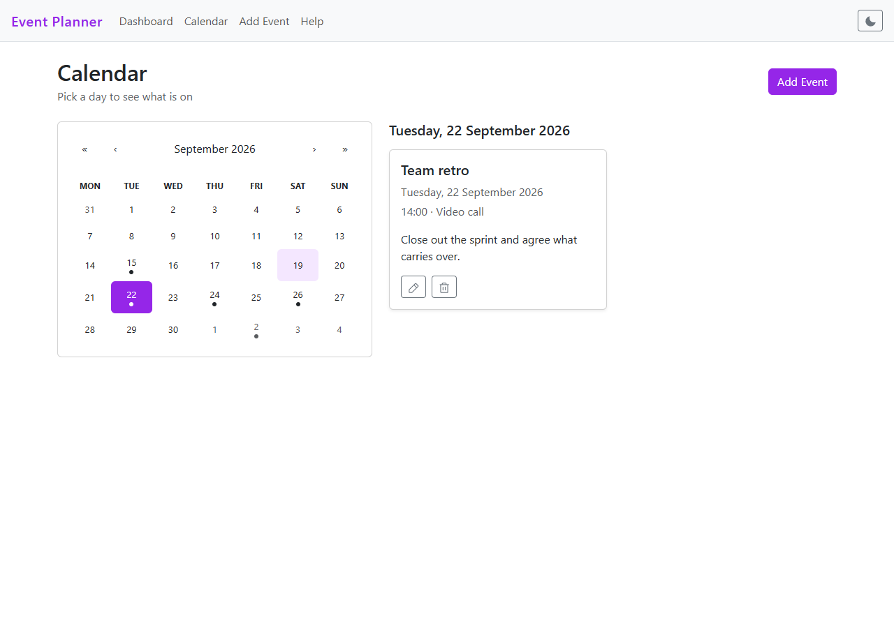
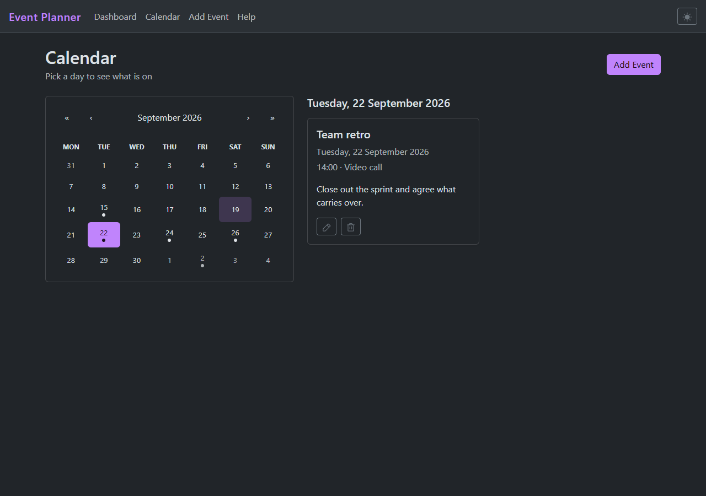

# Event Planner

A planner that keeps your events in your own browser. No account, no sign up, no
server holding your diary. Open it and start adding things.

**[event-planner.szstanton.com](https://event-planner.szstanton.com)**

There is nothing to log into. Add an event and it is there when you come back.
Everything lives in your browser's local storage, so your events stay on the
device you created them on and are never sent anywhere.

## Screenshots

**Dashboard**

| Light                                                            | Dark                                                           |
| ---------------------------------------------------------------- | -------------------------------------------------------------- |
|  |  |

**Calendar**

| Light                                                          | Dark                                                         |
| -------------------------------------------------------------- | ------------------------------------------------------------ |
|  |  |

## Features

- Create, edit and delete events with a date, time, location and description
- Month calendar that marks every day holding an event, and lists a day's events
  when you pick it
- Dashboard separates what is coming up from what has already happened
- Light and dark themes, following your system by default with a switch to
  override it
- Validation that will not let an event be scheduled into the past, while still
  allowing a past event to be corrected
- Works down to phone width, including the navigation menu

## Tech Stack

| Area     | Choice                |
| -------- | --------------------- |
| UI       | React                 |
| Build    | Vite                  |
| Routing  | React Router          |
| Styling  | Bootstrap             |
| Calendar | react-calendar        |
| Icons    | Phosphor              |
| Storage  | Browser local storage |
| Hosting  | Vercel                |

## Getting Started

Clone the repository:

```bash
git clone https://github.com/SZStanton/Event-Planner
cd Event-Planner
```

Install dependencies:

```bash
npm install
```

There are no environment variables to set. The app has no backend, so there is
nothing to point it at.

The three commands that matter:

```bash
npm run dev      # development server on http://localhost:5173
npm run build    # production build into dist/
npm run lint     # eslint across src/
```

## Testing

Vitest covers the date helpers, which is where the awkward logic lives. The
suite is pinned to a negative UTC offset, because date handling looks correct
from UTC+2 whether or not it is.

```bash
npm test
```

## What I Learned

This started as a bootcamp project, and it is where a lot of React stopped being
theory for me.

- **Shared state belongs in context.** Passing events down through every page
  was getting messy. Moving them into a provider and reading them back through
  my own hook meant any page could reach them, and a missing provider failed
  with a message that said so rather than a null error three files away.

- **Build a component around its props, not the screen it sits on.** Add and
  Edit are the same form with different starting values and a different button
  label. One `EventForm` taking both as props beat two files drifting apart.

- **`useState(() => load())` and `useState(load())` are not the same thing.**
  The first reads local storage once, when the component mounts. The second
  runs on every render. They look nearly identical and behave nothing alike.

- **React Router hands you pieces, not a flow.** `useParams` to find the event
  being edited, `useNavigate` to leave once it saves, and a route parameter
  instead of passing an object around.

- **Sort on write, not on read.** Re-sorting whenever an event is saved keeps
  ordering out of every component that renders a list. The alternative is the
  same logic in several places, waiting to disagree.
